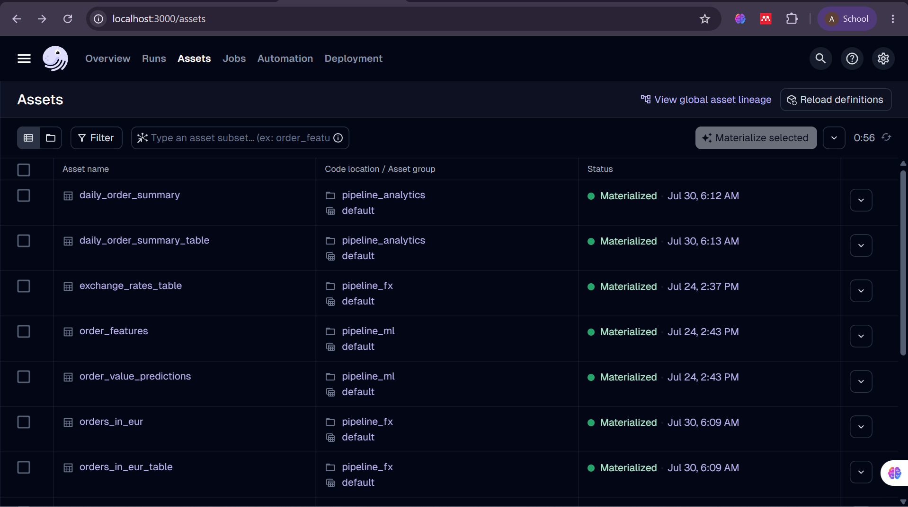
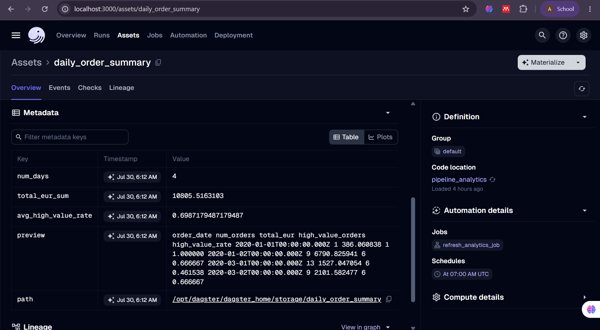
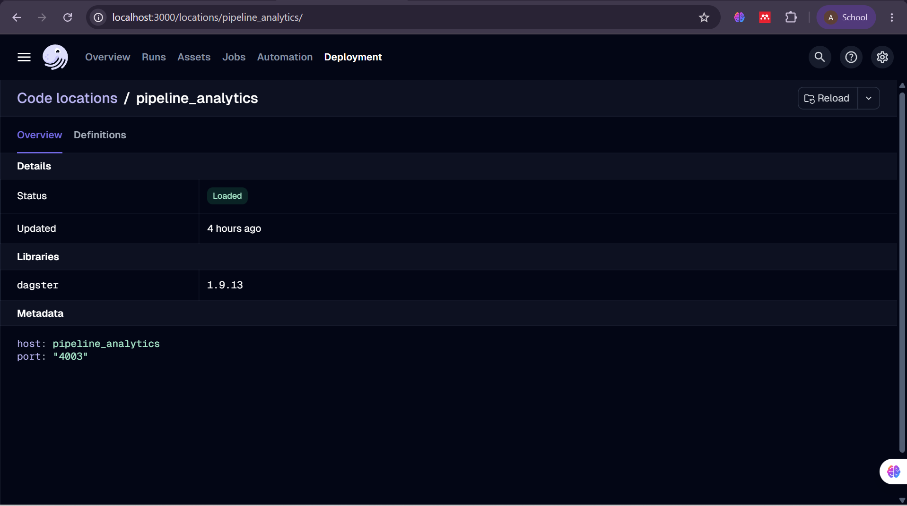

# pipeline_analytics

A cross-pipeline analytics layer that joins the EUR-converted order values
from `pipeline_fx` with the high-value-order predictions from `pipeline_ml`
into a single daily business summary table — the kind of report a stakeholder
would actually query, instead of three separate raw tables they'd have to
join themselves.

Built on top of [dagster-workshop-multi](https://github.com/<original-org>/dagster-workshop-multi),
a multi-container Dagster workshop — see that repo's README for the base
architecture (`pipeline_products`, `pipeline_fx`, `pipeline_ml`).

## What I built

- **Track:** B — cross-pipeline analytics
- **Data source:** no external API. Reads two tables already sitting in the
  shared warehouse: `orders_in_eur` (written by `pipeline_fx`, itself a join
  of `orders` + `products` + `exchange_rates` converted from USD to EUR —
  exercise ② of this workshop) and `order_value_predictions` (written by
  `pipeline_ml`).
- **Key assets:**
  - `daily_order_summary` — joins `orders_in_eur` with `order_value_predictions`
    on `order_id`, then groups by `order_date` to compute, per day: number of
    orders, total order value in EUR, and the share of orders predicted
    high-value.
  - `daily_order_summary_table` — writes that summary back to the warehouse
    as `daily_order_summary`, so it can be queried directly or plugged into a
    BI tool.
- **Quality gate:** `daily_summary_quality_check` fails the asset if any
  day's total EUR value is negative (a sign the upstream join or source data
  is broken) or if `high_value_rate` falls outside the valid 0–1 range. I
  picked these two checks because they catch join/aggregation bugs cheaply,
  without needing a ground-truth dataset to compare against — unlike
  `pipeline_ml`'s accuracy threshold, this asset has no "correct answer" to
  check against, only internal consistency.

## Architecture

```
                     dagster_webserver (:3000)  <-- workspace.yaml -->  dagster_daemon
                              |                                              |
                              +---------------------+-----------------------+
                                                     |
                             dagster_postgresql  (Dagster's own run/schedule/event storage)

  pipeline_products (:4000)      pipeline_fx (:4001)           pipeline_ml (:4002)
  fakestoreapi.com ->             api.frankfurter.app ->        trains a classifier on
  raw_products/raw_orders         raw_exchange_rates,            products+orders, writes
        |                         orders_in_eur                  predictions back
        v                              |                              |
  products, orders  ------------> warehouse_postgresql <--------------+
  tables                          (also: exchange_rates,
                                    orders_in_eur,
                                    order_value_predictions)
                                                     |
                                                     v
                                     pipeline_analytics (:4003)
                                     reads orders_in_eur + order_value_predictions,
                                     writes daily_order_summary
```

`pipeline_analytics` is the second "odd one out" alongside `pipeline_ml`: it
doesn't pull from an external API or train a model, it purely reads two
existing warehouse tables and reshapes them into a report — the same
gRPC-server-per-container pattern, just with a join instead of an API call
or a `.fit()` call.

## Running it

```bash
docker compose up --build
```

Open http://localhost:3000, find `pipeline_analytics` under Deployment >
Code Locations, and materialize its assets — after `pipeline_fx` and
`pipeline_ml` have run at least once, since `pipeline_analytics` reads
tables they write.

## Demo & Verification

Here is the step-by-step UI verification of `pipeline_analytics` running in Dagster:

1. **All Assets Materialized Successfully:**
   

2. **Asset Checks & Details:**
   

3. **Code Location Status:**
   

## What I'd do differently in production

This does a full truncate-and-load of `daily_order_summary` on every run,
same as the other pipelines — fine for a demo, but in production I'd
upsert/merge by `order_date` so a partial-day re-run doesn't wipe history
that hasn't been recomputed yet. I'd also add a check that every order in
`orders_in_eur` actually has a matching row in `order_value_predictions`
(right now an unmatched order just silently drops out of the join instead of
raising an alert), and move the two upstream table names (`orders_in_eur`,
`order_value_predictions`) into a small shared config instead of hardcoding
them as string literals in three places.
